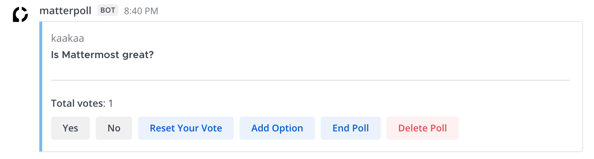

# 

Matterpoll is a plugin for [Mattermost](https://mattermost.com/). It allows users to create poll by using a slash command.

## Installation

In Mattermost, open **Main Menu > Plugin Marketplace** to install and configure Matterpoll.

For offline/air gapped installations, you can obtain a `.tar.gz` from https://github.com/matterpoll/matterpoll/releases.
In Mattermost, open **Main Menu > System Console > Plugins (BETA) > Plugin Management > Upload Plugin** to upload the .tar.gz.
Upgrades can be performed by importing the lastest release and confirm overwriting of the duplicate plugin ID.

## Settings
After the plugin has downloaded and been installed, click the **Configure** button. Alternatively, you can configure Matterpoll from **System Console > Plugins > Matterpoll**.

* **Trigger Word**: Change trigger word for poll command. (default `/poll`)
* **Experimental UI**: Enable new experimental UI for poll posts:
  - Change button color of voted answers
  - Hide poll management buttons (Add Option / Delete Poll / End Poll) from users who don't have permission

## Usage

`/poll "Is Matterpoll great?"` creates a poll with the answer options "Yes" and "No". You can also leave out the double quotes and just type `/poll Is Matterpoll great?`.

If you want to define all answer options by yourself, type `/poll "Is Matterpoll great?" "Of course" "In any case" "Definitely"`- Note that the double quotes are required in this case.

`/poll` show up a modal for creating a poll.

### Poll Settings

Poll Settings provide further customisation, e.g. `/poll "Is Matterpoll great?" "Of course" "In any case" "Definitely" --progress --anonymous`. The available Poll Settings are:
- `--anonymous`: Don't show who voted for what at the end
- `--progress`: During the poll, show how many votes each answer option got
- `--public-add-option`: Allow all users to add additional options
- `--public-delete-poll`: Allow any user to delete the poll
- `--public-end-poll`: Allow any user to end the poll
- `--votes=X`: Allow users to vote for X options

## Localization

Matterpoll supports localization of user specify messages. You can change language of poll message by setting it in **System Console > General > Localization > Default Server Language**. Language of messages that only a user can see (e.g.: help messages, error messages) use the language set in **Account Settings > Display > Language**.

The currently supported languages are:
- English
- French
- German
- Japanese
- Korean
- Polish
- Russian
- Simplified Chinese
- Spanish
- Traditional Chinese

## Troubleshooting

#### Pressing the poll buttons does nothing and creates a 400 error in the Mattermost log

Make sure to set your [Site URL](https://docs.mattermost.com/administration/config-settings.html?highlight=site%20url#site-url) properly.
For example, this error happens in case you set SiteURL starting with `http://`, in spite of running Mattermost server through https.

## Contributing

We welcome contributions for bug reports, issues, feature requests, feature implementations and pull requests. Feel free to [**file a new issue**](https://github.com/matterpoll/matterpoll/issues/new/choose) or join the [**Matterpoll channel**](https://community.mattermost.com/core/channels/matterpoll) on the Mattermost community server.

For a complete guide on contributing to Matterpoll, see the [Contribution Guideline](CONTRIBUTING.md).
